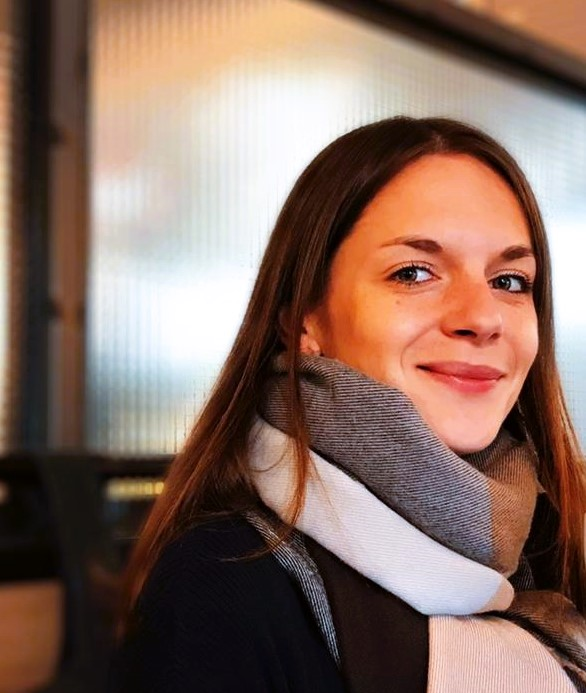

# **About me**

  

## Basic information
- Croatian!
- a wife, a sister, a daughter, an aunt, a friend and an assistant professor
- enjoys research, music, books, cycling, yoga, travel

## Current roles
- assistant professor (University of Zagreb, Faculty of Education and Rehabilitation Sciences)
- Fulbright scholar (Temple University, Philadelphia, 2024/2025)
- co-lead of the [Laboratory for Psycholinguistic Research, University of Zagreb](https://www.erf.unizg.hr/en/about_us/structure_and_management/laboratories/laboratory_for_psycholinguistic_research)
- vice-chair of the COST Action CA21131: [Enabling multilingual eye-tracking data collection for human and machine language processing research; MultiplEYE](https://multipleye.eu/)
- collaborator of the [Concepts and Cognition Laboratory, Eleanor M. Saffran Center for Cognitive Neuroscience, Temple Unversity](https://www.reilly-coglab.com/)
  
## Research interests and methods used in research
- developmental and acquired language disorders
- psycholinguistics (language development and processing across the lifespan)
- eye-tracking, corpus studies, neuropsychological testing etc.

## Work experience
- 11/07/2024-today: Assistant professor: University of Zagreb, Faculty of Education and Rehabilitation Sciences, Department of Speech Language Pathology (SLP)
- 20/10/2020-10/07/2024:	Postdoctoral research fellow: University of Zagreb, Faculty of Education and Rehabilitation Sciences, Department of SLP
- 20/10/2016–20/10/2020:	PhD, Croatian Science Foundation (CSF) Grant: University of Zagreb, Faculty of Education and Rehabilitation Sciences, Department of SLP 
- 06/2016–09/2017:	PhD, Research collaborator: 'Adult Language Processing' (Grant CSF-2421)
- 01/11/2014–21/02/2015: Research assistant, project 'Prerequisites for academic equality: early recognition of language disorders' (IPA, 2013-2015): University of Zagreb, Faculty of Education and Rehabilitation Sciences, Department of SLP

## Education
- 20/01/2017–06/05/2020:	PhD (summa cum laude): 'Psycholinguistic approach to structural-semantic factors in processing relative clauses': Doctoral studies in Linguistics, Faculty of Humanities and Social Sciences, University of Zagreb
- 16/10/2012–09/09/2014:	M.Sci. (summa cum laude): University of Zagreb, Faculty of Education and Rehabilitation Sciences, Department of SLP
- 22/09/2009–15/09/2012:	Bacc. (summa cum laude): University of Zagreb, Faculty of Education and Rehabilitation Sciences, Department of SLP
- 01/09/2005–19/05/2009: Highschool education: II. gymnasium, Zagreb (Croatia) 
