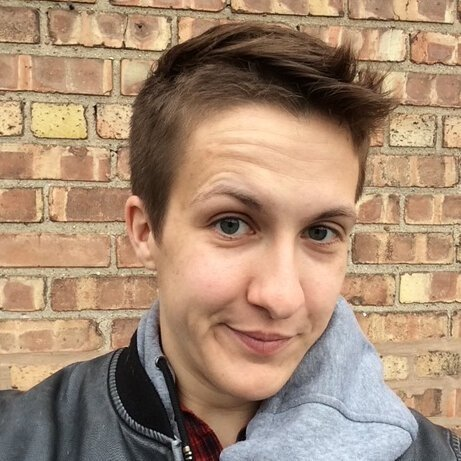

  

# **About me**

Avery Pattullo is a first-year PhD student in the [Concepts and Cognition Laboratory, Eleanor M. Saffran Center for Cognitive Neuroscience, Temple Unversity](https://www.reilly-coglab.com/) at Temple University. She is interested in too many things, including grounded cognition and semantics, neurogenic cursing, and how language changes as we age. Avery is a speech-language pathologist with expertise in dysphagia, voice, aphasia, and neurodegerative disorders. They are a parent, a hobby writer, crossword constructor, runner, cellist, and tall ship enthusiast.

## Education 
PhD in Commmunication Sciences and Disorders, Temple University (anticipated 2028) 
Primary advisor: Jamie Reilly, PhD 
MA in Speech, Language, and Hearing Science, Temple University (2023)
BA with honors in Psychology, University of Chicago (2011)
  
## Research interests and methods used in research
- semantic changes in aging and neurodegeneration
- embodied cognition, grounded semantics
- neurogenic cursing
- right hemisphere mediated language
- eye-tracking, EEG, corpus studies, neuropsychological testing etc.
